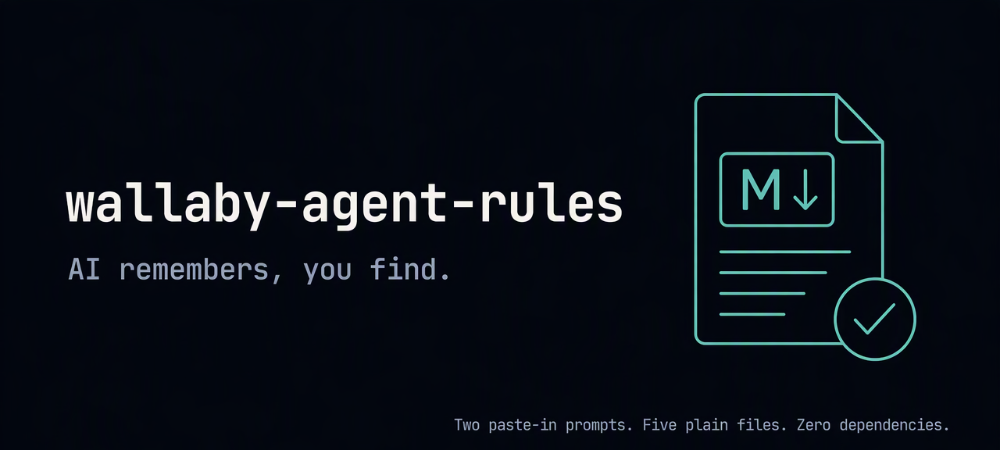

<!-- wallaby-agent-rules 1.1.0 -->
# wallaby-agent-rules

[](LICENSE)
[](CHANGELOG.md)
[](../../pulls)



**AI remembers, you find.**

Give your project's AI a long-term memory — and give yourself a map of the project. Two paste-in prompts, five plain files, zero dependencies. Works with any AI coding tool. 中文版：[README.zh-CN.md](README.zh-CN.md) / [PROMPT.zh-CN.md](PROMPT.zh-CN.md)。

We run this system on our own business. As of October 2026 it has caught 45 logged memory failures — each dated, sourced, and turned into a rule or a scan you can see in this repo ([the failure taxonomy, with receipts](https://wallabytoken.com/blog/p/ai-memory-benchmarks-wrong-thing.html)).

## The 30-second version

| Before | After |
|---|---|
| Fifty messages in, the AI's memory starts to rot — settled decisions get relitigated, file names get invented, and you stop trusting it. | `MEMORY.md`: one dated, sourced line per fact. On any conflict the file wins — flagged to you, never silently resolved. |
| "Where was that file?" — two weeks later, nobody knows. | `INDEX.md`: one line per file, always current. A lookup, not a search. |
| The project root slowly fills with scratch and build leftovers. | `python3 scripts/health_check.py` flags the clutter in seconds, weekly. |
| "Which version is live right now?" — the answer lives in someone's head. | `## Code & releases` section: the current version is a dated memory fact; releases and rollbacks get logged with commit references. |

## Get started — pick a path

Both paths are one prompt you paste to the AI working in your project. Full text lives in [PROMPT.md](PROMPT.md).

**🚀 One-click, ~30 seconds** — all defaults (solo developer, code project, trust-building mode on), zero questions:

```
Fetch https://raw.githubusercontent.com/Dawncoral/wallaby-agent-rules/main/PROMPT.md
and follow its "L0 — One-click install" section in this project.
```

**🎯 Custom, ~2 minutes** — the AI asks you 9 short questions (tool, code or not, project size, solo/team, chat volume, record style, tidy-up on/off, your ritual words, trust-building on/off), then builds the same system tuned to your answers:

```
Fetch https://raw.githubusercontent.com/Dawncoral/wallaby-agent-rules/main/PROMPT.md
and follow its "L1 — 9-question interview" section in this project.
```

Can't fetch URLs? Open [PROMPT.md](PROMPT.md) and paste the section directly — it's plain text.

## What you get

| File | Job |
|---|---|
| `AGENTS.md` (or `CLAUDE.md` / `.cursorrules`, per your tool) | Entry point — tells the AI to read its memory every session |
| `MEMORY.md` | Long-term memory: permanent facts, decisions, iron rules |
| `NOW.md` | Current state: work in flight, recently touched |
| `INDEX.md` | The project map: one line per file — first version generated by scanning your project on the spot. Scope: documents and knowledge files; code is tracked by git and your changelog, not duplicated here |
| `scripts/health_check.py` | Zero-dependency weekly check, ten scans: stray root files, build artifacts, index drift both ways, stale entries, entry-file size walls (bytes/lines/tokens, CJK-aware), undated facts, MEMORY.md budget with demote candidates, secrets hygiene, commit silence |
| `scripts/reconcile.py` | Zero-dependency weekly audit, two scans: log entries that claim "done" while NOW.md still lists the work in flight, and "done" claims with nothing to verify against |
| Trust-building mode (default on) | For the first two weeks, new long-term memories are *proposed* for your approval before they become permanent — you watch what the AI chooses to remember before letting it write freely |
| Code & releases (code projects) | The current released version is a dated memory fact, updated the moment it changes; every release, migration, or rollback gets logged with its commit reference |

The moment installation finishes, you watch the AI scan your project and hand you the first `INDEX.md` — "you find" delivered on the spot.

**New in 1.1.0**: three hygiene additions, each answering a failure mode we logged running this system on our own business: MEMORY.md aging (past the soft wall of ~150 dated lines or ~8k est. tokens, CJK-weighted, so a Chinese MEMORY.md hits the same wall — facts idle 30+ days move to LOG.md at closeout; silent below the wall), a secrets-hygiene scan that catches tracked credential files and common key patterns while ignoring placeholders (a reminder, not a safety net — the real defense is the habit of keeping keys out of git), and commit-silence detection (a git commit with no matching record in NOW.md/LOG.md gets flagged). Plus: INDEX.md's scope is now explicit (documents and knowledge files; code is git's job), and `extras/pre-commit.sample` ships as an optional hook for those who want enforcement anyway. It stays a sample on purpose: detection plus the closeout rhythm is the system; a blocking hook gets bypassed (`--no-verify`) the first time it annoys.

**New in 1.0.0**: the code-version memory module (mounted conditionally — the interview asks whether your project involves code and only adds it if yes), a full Chinese edition ([README.zh-CN.md](README.zh-CN.md) / [PROMPT.zh-CN.md](PROMPT.zh-CN.md)), and a renumbering to semantic versioning (earlier v1–v4.1 iterations are folded into 1.0.0).

**New in v4**: trust-building mode (approval-gated memory writes for the first two weeks — default on, one question in the interview, expires on its own), a tool-integration matrix with per-tool cards ([templates/integrations/](templates/integrations/)), and versioned GitHub Releases from now on.

New in v3.1: the **reconcile audit**. `python3 scripts/reconcile.py` diffs the dated log against current state — when the log says "shipped" but NOW.md still shows the work in flight, or a "done" points at no evidence, it says so. Write discipline always loosens; the audit is what catches it.

New in v3: the **closeout ritual**. Say "wrap up" and the AI triages everything the session produced — into long-term memory, the dated log, current state, or the bin — then checks what drifted from the plan. Memory stays true because someone closes. See the **L3** prompt in [PROMPT.md](PROMPT.md).

## Works in your tool

No plugin, no MCP server, no install — the entry file is the integration. Each tool reads its own; the setup interview picks the right one for you.

| Tool | Entry file | Notes |
|---|---|---|
| Claude Code | `CLAUDE.md` | Read at every session start; `/memory` opens it for quick edits |
| Codex | `AGENTS.md` | Native convention |
| Cursor | `AGENTS.md` | Native support; keep memory here rather than splitting into `.cursor/rules` |
| GitHub Copilot | `AGENTS.md` | Native support; `.github/copilot-instructions.md` also honored if present |
| OpenHands | `AGENTS.md` | Native — its system prompt tells the agent to maintain this file |
| Gemini CLI | `GEMINI.md` | Primary file; a one-line pointer to `AGENTS.md` also works |
| Anything else | `AGENTS.md` | The cross-tool convention; check your tool's docs |

Per-tool gotchas and a 30-second self-check for each: [templates/integrations/](templates/integrations/).

## How it works (four sentences)

1. The entry file makes the AI read `MEMORY.md` + `NOW.md` before every session — memory is a habit, not a feature.
2. `INDEX.md` turns "find me X" from a search into a lookup, and every new file is registered the moment it's created.
3. A weekly health check catches drift — stray files, artifacts, unregistered docs — before the mess compounds.
4. A weekly reconcile audit catches the other kind of drift: the gap between what the log claims and what the state file shows.

Everything is plain Markdown you can read, `git diff`, and edit. No vector store, no service, no lock-in.

## Updating

Already using this? Paste the **L2 — Upgrade check** prompt from [PROMPT.md](PROMPT.md) to your AI. It detects your version (via the first-line marker comment or file fingerprints), then proposes an incremental upgrade list — you approve item by item. **Your content is never overwritten.** Every version ships as a GitHub Release with migration notes — watch the repo to get notified. Version history and migration steps: [CHANGELOG.md](CHANGELOG.md); the one-page card for moving from pre-1.0 versions: [upgrade/pre-1.0.md](upgrade/pre-1.0.md).

## Roadmap

Shipped so far: the closeout ritual, the deeper health check (ten scans: drift, budgets, aging, secrets hygiene, commit silence), the reconcile audit, trust-building mode, tool integrations, the code-version module, and the Chinese edition. Next open drop is multi-agent / team memory discipline. Deeper governance (architecture review, managed oversight) is planned as a hosted offering rather than an open drop — watch the repo. Numbering is semantic from 1.0.0 on; earlier iterations (v1–v4.1) are folded into it — see [CHANGELOG.md](CHANGELOG.md).

## Also in this repo

- [`templates/`](templates/) — NOW / INDEX / LOG templates + the health check and reconcile scripts, ready to copy.
- [`templates/integrations/`](templates/integrations/) — per-tool cards: entry file, gotchas, 30-second self-check.
- [`upgrade/`](upgrade/) — one-page upgrade cards between versions.
- [`COMMERCIAL.md`](COMMERCIAL.md) — commercial licensing: what's free, what needs a license, how to reach us.
- [`README.zh-CN.md`](README.zh-CN.md) / [`PROMPT.zh-CN.md`](PROMPT.zh-CN.md) — 中文版说明与提示词。
- [`AGENTS.md`](AGENTS.md) / [`MEMORY.md`](MEMORY.md) — the v1 starter templates (token-budget discipline, three-tier memory, stakeholder register), still valid and still dogfooded by this repo itself.
- [`examples/`](examples/) — filled-in MEMORY / NOW / INDEX examples: what "good" looks like two weeks in, not just on day one.

## Who built this

Wallaby Token (WALLABY DATA PTY LTD, ABN 90 701 729 964) provides inference-as-a-service for open-weight large language models. This memory system runs our own project daily — not advice we sell, but infrastructure we depend on. Full write-up: [wallabytoken.com](https://www.wallabytoken.com).

## License

MIT + [Commons Clause](LICENSE) — free for personal projects, research, and use inside your own organization. Selling it (bundled, hosted, or as paid services built on it) needs a commercial license — see [COMMERCIAL.md](COMMERCIAL.md). Releases before v4.0.1 remain under plain MIT.
